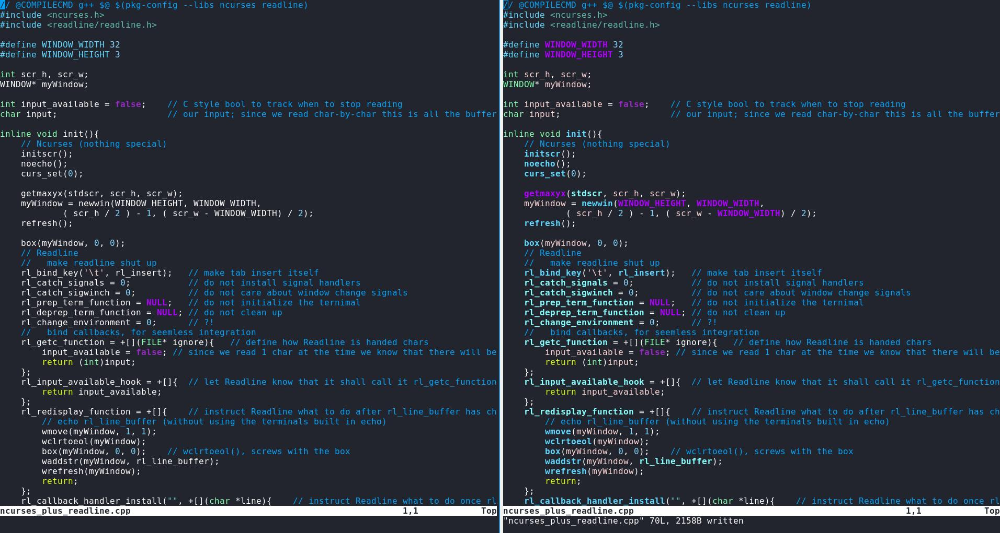

# HiTags
Hitags is a Vim plugin which harnesses the power of ctags
to provide dynamic symbol (e.g. variable, function) name highlighting.

# Before/After


# Dependencies
 + [mimetype](https://packages.gentoo.org/packages/dev-perl/File-MimeInfo) (sadly, `file -i` does not suffice)
 + python3 (system installation, not Vim compile flag)
 + ctags (tested with Universal ctags)
 + gcc/clang (to preprocess C/C++ files)

# Installation
1. Clone the source

2. Run:
```Bash
 $ make; make install
```
Note: if you don't have (GNU) Make installed for some reason,
opening `Makefile` with vim and copy pasting the commands (whats indented)
to your shell should also suffice

3. Configure Vim to actually invoke the plugin.
    Achive this by appending / overriding the following definition in your .vimrc.
```VimScript
let g:hitags_events = ["BufWrite"]  " trigger a symbol update on writes
```

4. **_(Optional)_** Further configure HiTags by editing ~/.vim/plugin/hitags.vim.
All required details are commented right there in the script.

5. Enjoy
