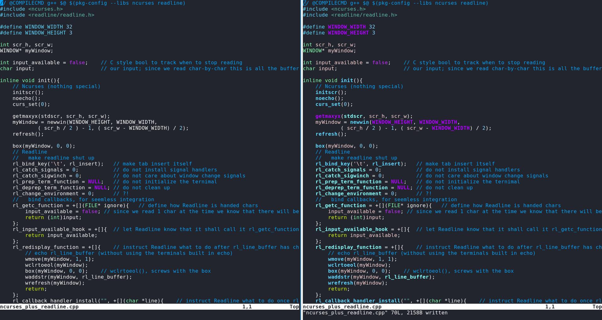

# HiTags
> Hitags is a Vim plugin which harnesses the power of ctags
> to provide dynamic symbol (e.g. variable, function) name highlighting.

## Before/After


## Runtime dependencies
 + [mimetype](https://packages.gentoo.org/packages/dev-perl/File-MimeInfo) (sadly, `file -i` does not suffice)
 + python3 (system installation, not Vim compile flag)
 + ctags (tested with Universal ctags)
 + **_(Optional)_** gcc/clang/fcpp (to preprocess C/C++ files)

## Installation
1. Pack this repository.

> [!NOTE]
> "Pack" as in the Vim 8 feature.

2. Configure Vim to actually invoke the plugin.
    Achieve this by appending / overriding the following definition in your .vimrc.
```VimScript
let g:hitags_events = ["BufWrite"]  " trigger a symbol update on writes
```

3. **_(Optional)_** Further configure HiTags by editing `plugin/hitags.vim`.
All required details are commented right there in the script.

4. Enjoy

## Notes

Now, comes with experimental tool tips in insert mode.
